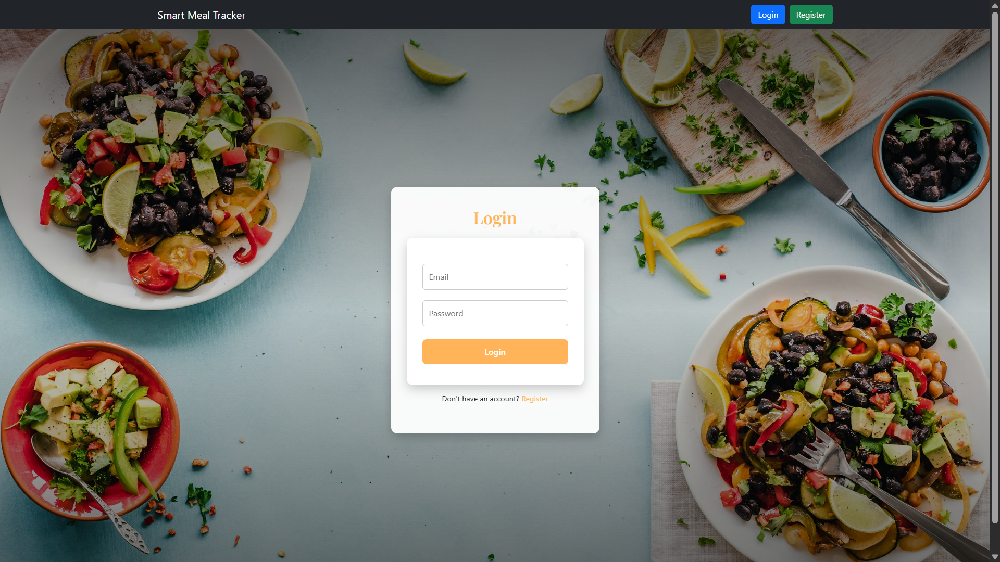
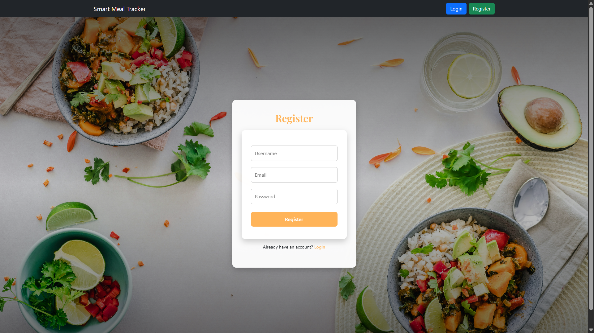
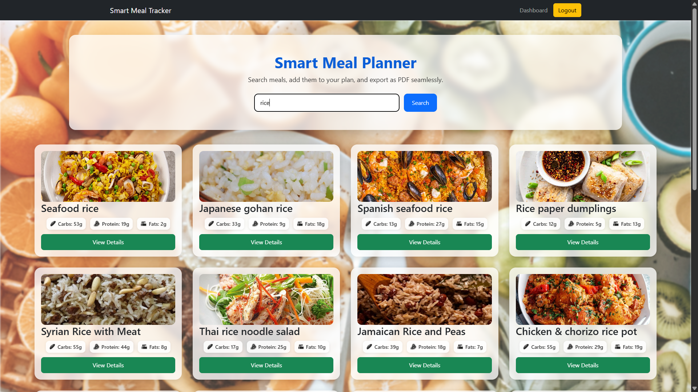
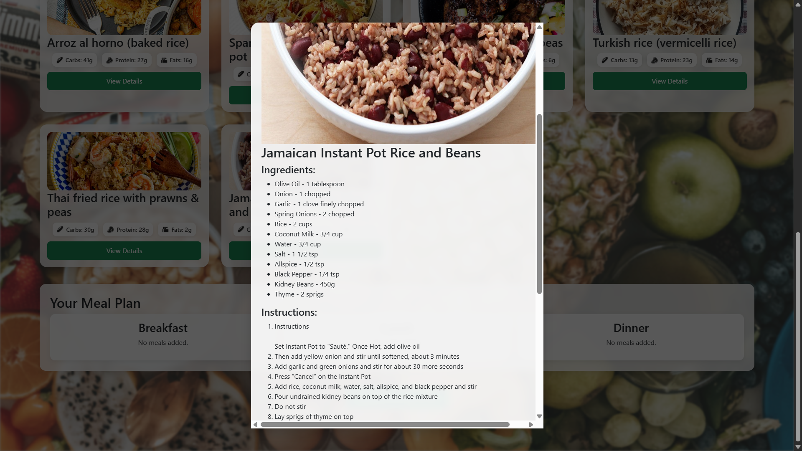
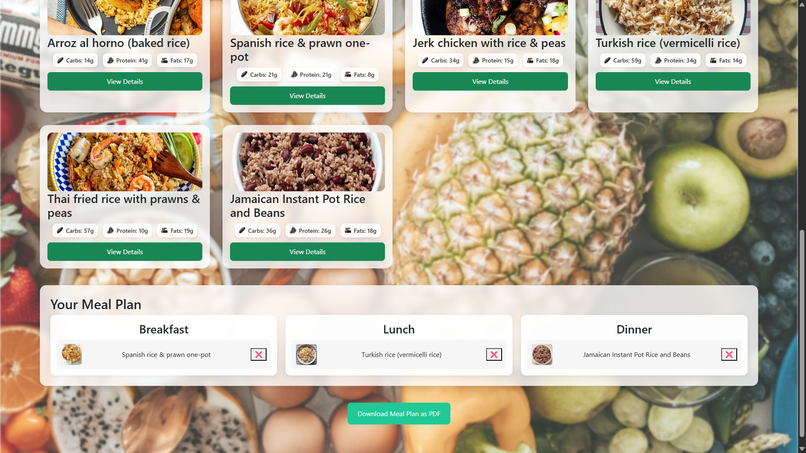

# Smart Meal Planner 🍽️

Smart Meal Planner is a web‑based application developed to simplify the process of daily meal planning. The project aims to help users organize their meals in a smarter and more structured way, reducing confusion and saving time in day‑to‑day food decisions.

This application is designed with a focus on simplicity, usability, and clean design, making it suitable for academic projects, internships, and personal learning in full‑stack web development.

---

## 📌 About the Project

In modern lifestyles, people often struggle to decide what to eat every day while also trying to maintain a healthy routine. **Smart Meal Planner** addresses this problem by providing a digital platform where meal planning becomes easy and systematic.

The project emphasizes:

* Simplifying meal‑related decisions
* Providing a smooth and user‑friendly experience
* Demonstrating practical use of modern web technologies

Smart Meal Planner is built as a learning‑oriented project that reflects real‑world application development practices.

---

## 🎯 Project Objectives

The main objectives of the Smart Meal Planner project are:

* To create a simple and interactive meal planning application
* To help users organize their daily meals efficiently
* To apply frontend and backend concepts in a real project
* To improve understanding of component‑based development

---

## ✨ Key Features

* Clean and intuitive user interface
* Easy‑to‑use meal planning workflow
* Responsive design for different screen sizes
* Structured application flow
* Practical implementation of modern web development concepts

---

## 🚀 Application Overview

The Smart Meal Planner application allows users to interact with a well‑designed interface where meal‑related activities can be planned and managed efficiently. The project focuses more on clarity and functionality rather than unnecessary complexity, making it easy to understand and use.

This project also demonstrates how a full‑stack application can be structured and developed step by step, which is helpful for beginners and students.

---

## 📈 Future Enhancements

The project can be further improved by adding advanced features such as:

* User authentication and profile management
* Personalized meal suggestions
* Nutrition and calorie tracking
* Database integration for storing user data
* Admin panel for managing meal data

---

## 👨‍💻 Author

**Pushkar Pandey**
B.Tech Student | Aspiring Full Stack Developer

---

## 📄 Disclaimer

This project is developed for educational, academic, and learning purposes. It is intended to demonstrate practical implementation of web development concepts.

---

## ⭐ Support
If you find this project helpful or interesting, feel free to give it a ⭐ on GitHub.

## 🖼 Screenshots

